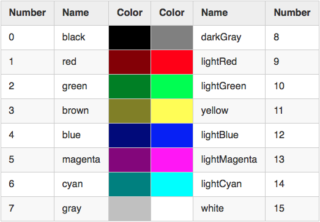
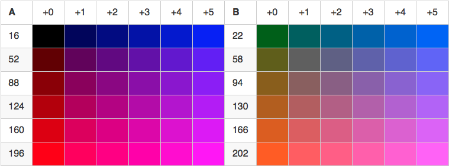
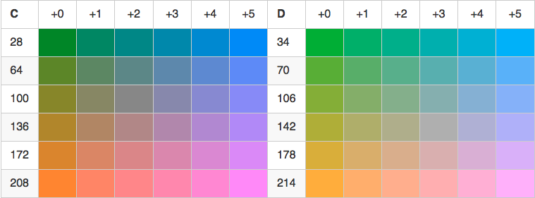
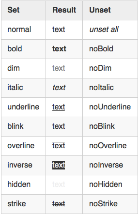

# ANSITerminal

**ANSITerminal** is an open source Swift library to access ANSI Terminal and (almost) all of its features. It's including text coloring, text styling, cursor and screen handling, and direct keyboard input. **ANSITerminal** is based on standard ANSI features which is commonly supported on Unix terminals especially such as xterm and VT-100 compatible.

## Usage

Using **ANSITerminal** library is as easy as putting `import ANSITerminal` in your Swift program then you will be able to use any functions or extensions provided by this library. The main advantage of using this library instead of something like [ncurses](https://www.gnu.org/software/ncurses/) is it doesn't take over the whole screen. You may use this library to complement your common console program.

#### Using Swift Package Manager

**ANSITerminal** only supports library distribution through [Swift Package Manager](https://swift.org/package-manager). To use ANSITerminal, simply add a dependency into your project's `package.swift` file. Here's `package.swift` example from [ansiDemo](https://github.com/pakLebah/ansiDemo) project.

```swift
// swift-tools-version:5.0

import PackageDescription

let package = Package(
    name: "ansiDemo",
    dependencies: [
        .package(url: "https://github.com/pakLebah/ANSITerminal", from: "0.0.1"),
    ],
    targets: [
        .target(
            name: "ansiDemo",
            dependencies: ["ANSITerminal"],
            path: "Sources"),
    ]
)
```

You just need to add a package dependency pointed to [ANSITerminal's GitHub repo](https://github.com/pakLebah/ANSITerminal) and `"ANSITerminal"` item into target dependency. Then you should be able to put `import ANSITerminal` in you Swift program and enjoy ANSI terminal features. That's all.

If you find a missing ANSI feature that you need, you could simply call `swift package edit ANSITerminal`. SPM will create a local copy of ANSITerminal for you, so you could add any missing features by yourself. Everytime you build the project, Swift will refers to the local copy instead of the original source. Once you done with it, don't forget to send a pull request to me. I'll be happy to accept any useful contributions to ANSITerminal from anyone.

## Features

### Text Coloring

ANSI color is available as property to `String` type through extension. To color a text, simply follow the text with the color's name. For example, `'text'.blue` will produce <span style="color: blue">text</span> (blue text)* on the screen. To set text background color, simply follow the text with the color's name but with `on` prefix. For example, `'text'.onCyan` will produce <span style="background: cyan">text</span> (black text over cyan background) on the screen. As coloring is available as property to `String`, you may combine them. For example, `'text'.blue.onCyan` will produce <span style="color: blue; background: cyan">text</span> (blue text over cyan background) on the screen. It's so easy!

But that's only available for 16 system colors. Most ANSI terminals also support 256 colors. To use 256 colors palette, use `foreColor(_:)` type extension method to set text color and `backColor(_:)` to set text background color. You may also want to use `colors(_: _:)` with text color and background color respectively. Those type methods works just like the type properties mentioned before. For example, `'text'.foreColor(196)` will produce <span style="color: #ff0000">text</span> (red text) on the screen.

The `String` extension mechanism sets color only for the text. After the text, the color is set back to the default, both for text and background color. If you want more control over the mechanism, you could use `setColor(fore: back:)` function for 16 colors system and `setColors(_: _:)` function for 256 colors palette. Those functions do not revert color back to the default, so you must not forget to call `setDefault(color: style:)` to turn ANSI attributes (either color or style) back to the default. Otherwise, your terminal color will set to the last color settings.

Below are the default color palette for ANSI terminal. You may need to look it up if you want to use 256 colors palette.

#### ANSI Color Palette

16 Colors (System)


<!-- <table>
  <thead style="background:#eeeeee"><td><b>Number</b></td><td><b>Name</b></td><td><b>Color</b></td><td><b>Color</b></td><td><b>Name</b></td><td><b>Number</b></td></thead>
  <tr><td>0</td><td>black  </td><td style="background-color:#000000"></td><td style="background:#808080"></td><td>darkGray    </td><td> 8</td></tr>
  <tr><td>1</td><td>red    </td><td style="background-color:#800000"></td><td style="background:#ff0000"></td><td>lightRed    </td><td> 9</td></tr>
  <tr><td>2</td><td>green  </td><td style="background-color:#008000"></td><td style="background:#00ff00"></td><td>lightGreen  </td><td>10</td></tr>
  <tr><td>3</td><td>brown  </td><td style="background-color:#808000"></td><td style="background:#ffff00"></td><td>yellow      </td><td>11</td></tr>
  <tr><td>4</td><td>blue   </td><td style="background-color:#000080"></td><td style="background:#0000ff"></td><td>lightBlue   </td><td>12</td></tr>
  <tr><td>5</td><td>magenta</td><td style="background-color:#800080"></td><td style="background:#ff00ff"></td><td>lightMagenta</td><td>13</td></tr>
  <tr><td>6</td><td>cyan   </td><td style="background-color:#008080"></td><td style="background:#00ffff"></td><td>lightCyan   </td><td>14</td></tr>
  <tr><td>7</td><td>gray   </td><td style="background-color:#c0c0c0"></td><td style="background:#ffffff"></td><td>white       </td><td>15</td></tr>
</table> -->

216 Colors (by block)

    


<!-- <table>
<thead><td><b>A</b></td><td> +0 </td><td> +1 </td><td> +2 </td><td> +3 </td><td> +4 </td><td> +5 </td><td><b>B</b></td><td> +0 </td><td> +1 </td><td> +2 </td><td> +3 </td><td> +4 </td><td> +5 </td></thead>
<tr><td> 16</td><td style="background:#000000"></td><td style="background:#00005f"></td><td style="background:#000087"></td><td style="background:#0000af"></td><td style="background:#0000d7"></td><td style="background:#0000ff"></td><td> 22</td><td style="background:#005f00"></td><td style="background:#005f5f"></td><td style="background:#005f87"></td><td style="background:#005faf"></td><td style="background:#005fd7"></td><td style="background:#005fff"></td></tr>
<tr><td> 52</td><td style="background:#5f0000"></td><td style="background:#5f005f"></td><td style="background:#5f0087"></td><td style="background:#5f00af"></td><td style="background:#5f00d7"></td><td style="background:#5f00ff"></td><td> 58</td><td style="background:#5f5f00"></td><td style="background:#5f5f5f"></td><td style="background:#5f5f87"></td><td style="background:#5f5faf"></td><td style="background:#5f5fd7"></td><td style="background:#5f5fff"></td></tr>
<tr><td> 88</td><td style="background:#870000"></td><td style="background:#87005f"></td><td style="background:#870087"></td><td style="background:#8700af"></td><td style="background:#8700d7"></td><td style="background:#8700ff"></td><td> 94</td><td style="background:#875f00"></td><td style="background:#875f5f"></td><td style="background:#875f87"></td><td style="background:#875faf"></td><td style="background:#875fd7"></td><td style="background:#875fff"></td></tr>
<tr><td>124</td><td style="background:#af0000"></td><td style="background:#af005f"></td><td style="background:#af0087"></td><td style="background:#af00af"></td><td style="background:#af00d7"></td><td style="background:#af00ff"></td><td>130</td><td style="background:#af5f00"></td><td style="background:#af5f5f"></td><td style="background:#af5f87"></td><td style="background:#af5faf"></td><td style="background:#af5fd7"></td><td style="background:#af5fff"></td></tr>
<tr><td>160</td><td style="background:#d70000"></td><td style="background:#d7005f"></td><td style="background:#d70087"></td><td style="background:#d700af"></td><td style="background:#d700d7"></td><td style="background:#d700ff"></td><td>166</td><td style="background:#d75f00"></td><td style="background:#d75f5f"></td><td style="background:#d75f87"></td><td style="background:#d75faf"></td><td style="background:#d75fd7"></td><td style="background:#d75fff"></td></tr>
<tr><td>196</td><td style="background:#ff0000"></td><td style="background:#ff005f"></td><td style="background:#ff0087"></td><td style="background:#ff00af"></td><td style="background:#ff00d7"></td><td style="background:#ff00ff"></td><td>202</td><td style="background:#ff5f00"></td><td style="background:#ff5f5f"></td><td style="background:#ff5f87"></td><td style="background:#ff5faf"></td><td style="background:#ff5fd7"></td><td style="background:#ff5fff"></td></tr>
<thead><td><b>C</b></td><td> +0 </td><td> +1 </td><td> +2 </td><td> +3 </td><td> +4 </td><td> +5 </td><td><b>D</b></td><td> +0 </td><td> +1 </td><td> +2 </td><td> +3 </td><td> +4 </td><td> +5 </td></thead>
<tr><td> 28</td><td style="background:#008700"></td><td style="background:#00875f"></td><td style="background:#008787"></td><td style="background:#0087af"></td><td style="background:#0087d7"></td><td style="background:#0087ff"></td><td> 34</td><td style="background:#00af00"></td><td style="background:#00af5f"></td><td style="background:#00af87"></td><td style="background:#00afaf"></td><td style="background:#00afd7"></td><td style="background:#00afff"></td></tr>
<tr><td> 64</td><td style="background:#5f8700"></td><td style="background:#5f875f"></td><td style="background:#5f8787"></td><td style="background:#5f87af"></td><td style="background:#5f87d7"></td><td style="background:#5f87ff"></td><td> 70</td><td style="background:#5faf00"></td><td style="background:#5faf5f"></td><td style="background:#5faf87"></td><td style="background:#5fafaf"></td><td style="background:#5fafd7"></td><td style="background:#5fafff"></td></tr>
<tr><td>100</td><td style="background:#878700"></td><td style="background:#87875f"></td><td style="background:#878787"></td><td style="background:#8787af"></td><td style="background:#8787d7"></td><td style="background:#8787ff"></td><td>106</td><td style="background:#87af00"></td><td style="background:#87af5f"></td><td style="background:#87af87"></td><td style="background:#87afaf"></td><td style="background:#87afd7"></td><td style="background:#87afff"></td></tr>
<tr><td>136</td><td style="background:#af8700"></td><td style="background:#af875f"></td><td style="background:#af8787"></td><td style="background:#af87af"></td><td style="background:#af87d7"></td><td style="background:#af87ff"></td><td>142</td><td style="background:#afaf00"></td><td style="background:#afaf5f"></td><td style="background:#afaf87"></td><td style="background:#afafaf"></td><td style="background:#afafd7"></td><td style="background:#afafff"></td></tr>
<tr><td>172</td><td style="background:#d78700"></td><td style="background:#d7875f"></td><td style="background:#d78787"></td><td style="background:#d787af"></td><td style="background:#d787d7"></td><td style="background:#d787ff"></td><td>178</td><td style="background:#d7af00"></td><td style="background:#d7af5f"></td><td style="background:#d7af87"></td><td style="background:#d7afaf"></td><td style="background:#d7afd7"></td><td style="background:#d7afff"></td></tr>
<tr><td>208</td><td style="background:#ff8700"></td><td style="background:#ff875f"></td><td style="background:#ff8787"></td><td style="background:#ff87af"></td><td style="background:#ff87d7"></td><td style="background:#ff87ff"></td><td>214</td><td style="background:#ffaf00"></td><td style="background:#ffaf5f"></td><td style="background:#ffaf87"></td><td style="background:#ffafaf"></td><td style="background:#ffafd7"></td><td style="background:#ffafff"></td></tr>
<thead><td><b>E</b></td><td> +0 </td><td> +1 </td><td> +2 </td><td> +3 </td><td> +4 </td><td> +5 </td><td><b>F</b></td><td> +0 </td><td> +1 </td><td> +2 </td><td> +3 </td><td> +4 </td><td> +5 </td></thead>
<tr><td> 40</td><td style="background:#00d700"></td><td style="background:#00d75f"></td><td style="background:#00d787"></td><td style="background:#00d7af"></td><td style="background:#00d7d7"></td><td style="background:#00d7ff"></td><td> 46</td><td style="background:#00ff00"></td><td style="background:#00ff5f"></td><td style="background:#00ff87"></td><td style="background:#00ffaf"></td><td style="background:#00ffd7"></td><td style="background:#00ffff"></td></tr>
<tr><td> 76</td><td style="background:#5fd700"></td><td style="background:#5fd75f"></td><td style="background:#5fd787"></td><td style="background:#5fd7af"></td><td style="background:#5fd7d7"></td><td style="background:#5fd7ff"></td><td> 82</td><td style="background:#5fff00"></td><td style="background:#5fff5f"></td><td style="background:#5fff87"></td><td style="background:#5fffaf"></td><td style="background:#5fffd7"></td><td style="background:#5fffff"></td></tr>
<tr><td>112</td><td style="background:#87d700"></td><td style="background:#87d75f"></td><td style="background:#87d787"></td><td style="background:#87d7af"></td><td style="background:#87d7d7"></td><td style="background:#87d7ff"></td><td>118</td><td style="background:#87ff00"></td><td style="background:#87ff5f"></td><td style="background:#87ff87"></td><td style="background:#87ffaf"></td><td style="background:#87ffd7"></td><td style="background:#87ffff"></td></tr>
<tr><td>148</td><td style="background:#afd700"></td><td style="background:#afd75f"></td><td style="background:#afd787"></td><td style="background:#afd7af"></td><td style="background:#afd7d7"></td><td style="background:#afd7ff"></td><td>154</td><td style="background:#afff00"></td><td style="background:#afff5f"></td><td style="background:#afff87"></td><td style="background:#afffaf"></td><td style="background:#afffd7"></td><td style="background:#afffff"></td></tr>
<tr><td>184</td><td style="background:#d7d700"></td><td style="background:#d7d75f"></td><td style="background:#d7d787"></td><td style="background:#d7d7af"></td><td style="background:#d7d7d7"></td><td style="background:#d7d7ff"></td><td>190</td><td style="background:#d7ff00"></td><td style="background:#d7ff5f"></td><td style="background:#d7ff87"></td><td style="background:#d7ffaf"></td><td style="background:#d7ffd7"></td><td style="background:#d7ffff"></td></tr>
<tr><td>220</td><td style="background:#ffd700"></td><td style="background:#ffd75f"></td><td style="background:#ffd787"></td><td style="background:#ffd7af"></td><td style="background:#ffd7d7"></td><td style="background:#ffd7ff"></td><td>226</td><td style="background:#ffff00"></td><td style="background:#ffff5f"></td><td style="background:#ffff87"></td><td style="background:#ffffaf"></td><td style="background:#ffffd7"></td><td style="background:#ffffff"></td></tr>
</table> -->

Grayscale Colors


<!-- <table>
  <tr><td>»</td><td>232</td><td>233</td><td>234</td><td>235</td><td>236</td><td>237</td><td>238</td><td>239</td><td>240</td><td>241</td><td>242</td><td>243</td></tr>
  <tr><td>Black to Gray</td><td style="background:#080808"></td><td style="background:#121212"></td><td style="background:#1c1c1c"></td><td style="background:#262626"></td><td style="background:#303030"></td><td style="background:#3a3a3a"></td><td style="background:#444444"></td><td style="background:#4e4e4e"></td><td style="background:#585858"></td><td style="background:#626262"></td><td style="background:#6c6c6c"></td><td style="background:#767676"></td></tr>
  <tr><td>Gray to White</td><td style="background:#808080"></td><td style="background:#8a8a8a"></td><td style="background:#949494"></td><td style="background:#9e9e9e"></td><td style="background:#a8a8a8"></td><td style="background:#b2b2b2"></td><td style="background:#bcbcbc"></td><td style="background:#c6c6c6"></td><td style="background:#d0d0d0"></td><td style="background:#dadada"></td><td style="background:#e4e4e4"></td><td style="background:#eeeeee"></td></tr>
  <tr><td>«</td><td>244</td><td>245</td><td>246</td><td>247</td><td>248</td><td>249</td><td>250</td><td>251</td><td>252</td><td>253</td><td>254</td><td>255</td></tr>
</table> -->

### Text Styling

Similar to text coloring, text styling is also available as property to `String` type. To style a text, simply follow the text with a style name. For example, `'text'.bold` will produce **text** on the screen, `'text'.italic` will produce *text* on the screen, etc. There are 10 styles available on ANSI terminal, but not all of them are supported by every kind of ANSI terminal. Fortunately, `normal`, `bold`, `italic`, and `inverse` are mostly supported. So, if you want to use the other styles, make sure your users' terminal supports them.

Since color and style are both ANSI attributes, you may also combine them in a text. For example, `'text'.blue.bold` will <span style="color: blue">**text**</span> (bold blue text) on the screen. Also similar to text coloring, there is also `setStyle(_:)` function to fix a text style until you call `setDefault(color: style:)` function to turn ANSI attributes (color and style) back to the default.

Here are the available text styles on ANSI terminal:


<!-- <table>
  <thead style="background:#eeeeee"><td><b>Set</b></td><td><b>Result</b></td><td><b>Unset</b></td></thead>
  <tr><td>normal</td>   <td>text</td>                                           <td><i>unset all</i></td></tr>
  <tr><td>bold</td>     <td><b>text</b></td>                                    <td>noBold</td></tr>
  <tr><td>dim</td>      <td><span style="color: gray">text</span></td>          <td>noDim</td></tr>
  <tr><td>italic</td>   <td><i>text</i></td>                                    <td>noItalic</td></tr>
  <tr><td>underline</td><td><u>text</u></td>                                    <td>noUnderline</td></tr>
  <tr><td>blink</td>    <td><blink>text</blink></td>                            <td>noBlink</td></tr>
  <tr><td>overline</td> <td><span style="text-decoration: overline">text</span></td><td>noOverline</td></tr>
  <tr><td>inverse</td>  <td><span style="color: #eeeeee; background: #333333">text</span></td><td>noInverse</td></tr>
  <tr><td>hidden</td>   <td><span style="color: #eeeeee">text</span></td>       <td>noHidden</td></tr>
  <tr><td>strike</td>   <td><s>text</s></td>                                    <td>noStrike</td></tr>
</table> -->

### Cursor and Screen Handling

#### Cursor Related Functions

1. `storeCursorPosition()` to store current cursor position.
2. `restoreCursorPosition()` to restore last saved cursor position.
3. `cursorOn()` to make cursor visible.
4. `cursorOff()` to make cursor invisible (hidden).
5. `moveTo(_: _:)` to position cursor to given `row` and `col[umn]` respectively.
6. `readCursorPosition() → (row: col:)` to get current cursor position.

#### Screen Related Functions

1. `clearScreen()` to clear the entire screen and put cursor at home position.
2. `clearLine()` to clear the entire line of current cursor position.
3. `clearToEndOfLine()` to clear the line of current cursor position to the end of line.
4. `scrollRegion(top: bottom:)` to set scrolling region of the screen.
5. `readScreenSize() → (row: col:)` to get current screen size in `row` and `col[umn]`. Please note that this function is not supported on emulated terminal such as [VS Code](https://code.visualstudio.com/)'s integrated terminal or [repl.it](replit.com)'s web terminal.

### Keyboard Input Handling

1. `keyPressed() → Bool` to check whether any keys on the keyboard is pressed.
2. `readCode() → Int` to read keyboard input one by one directly from standard input as ASCII code.
3. `readChar() → Character` to read keyboard input one by one directly from standard input as `Character`.
4. `readKey() → (code: meta: [])` to read keyboard input in advance manner, returns ASCII code and meta keys (`shift`, `control`, `alt`), if available. This function is important for complex keyboard input such as arrow keys, function keys (F1..F12), and any other possible combinations, which are common in games.

### Miscellaneous Functions

1. `delay(_:)` to suspend program execution in microseconds.
2. `clearBuffer(isOut: isIn:)` to clear standard input/output buffer.
3. `write(_:... suspend:)` to directly write text into standard output with optional `suspend` delay.
4. `writeln(_:... suspend:)` to directly write text with additional `newline` into standard output.
5. `ask(_:) → String` is a shortcut to ask for a question from user.

I consider those as the most useful and used functions in common console applications. You should look into the source code files to see the rest of available functions. I will update the documentation to be more complete. A simple demo program is available [here](https://github.com/pakLebah/ansiDemo).

If you have any issues using this library, feel free to submit an issue. Thank you.

\________    
\* GitHub's Markdown doesn't support custom text color via CSS.